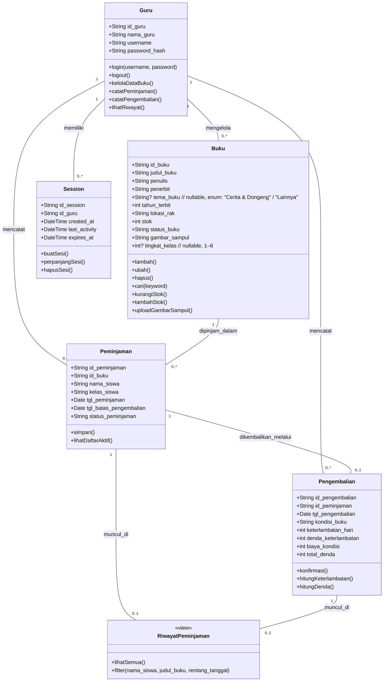

# Class Diagram — Sistem Informasi Perpustakaan SD Negeri Tamanan

---

## Revision History

| Version | Date | Author | Description |
|---------|------|--------|-------------|
| 1.0 | 2026-07-10 | Kelompok DPSI BRAYYY | Initial draft — class diagram dasar (Guru, Buku, Peminjaman, Pengembalian, Session, RiwayatPeminjaman). Menyertakan field gambar_sampul dan tingkat_kelas. |
| **1.1** | **2026-07-11** | **Kelompok DPSI BRAYYY** | **Ubah `tema_buku` menjadi nullable enum (`+String?`) dengan catatan nilai "Cerita & Dongeng" / "Lainnya"; ubah `tingkat_kelas` menjadi nullable (`+int?`). Sinkron data_model.md v1.5 & srs.md v3.6.** |