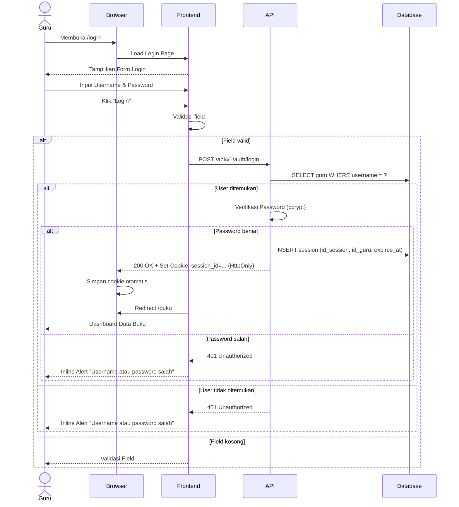

# System Logic: UC-001 Autentikasi Guru (Login)

**Document Version:** v1.3 (Perbaikan rule Rate Limiting yang kontradiktif dengan model session-cookie)

**Use Case ID:** UC-001

**Use Case Name:** Autentikasi Guru (Login)

**Status:** Draft

**Last Updated:** 2026-07-10

**Author:** Kelompok DPSI BRAYYY

---

# 1. Overview

Dokumen ini mendefinisikan logika sistem untuk proses autentikasi Guru, meliputi validasi kredensial, pembuatan sesi pengguna berbasis **session-cookie (HttpOnly)**, manajemen session timeout, serta kontrak API yang digunakan selama proses login dan logout. Sesuai `srs.md` v3.4 dan `data_model.md` v1.3, sistem **tidak** menggunakan Bearer Token — token sesi disimpan sepenuhnya sebagai HttpOnly Cookie yang tidak dapat diakses oleh JavaScript frontend, mengikuti prinsip least-privilege terhadap XSS.

---

# 2. Related Screens

| Page ID (IA) | Page Name | Route | Access Role |
| --- | --- | --- | --- |
| PAGE-001 | Login | `/login` | Tamu / Guest |

---

# 3. Related Entities

| Entity (Data Model) | Peran dalam Use Case Ini |
| --- | --- |
| `guru` | Dibaca untuk verifikasi username & password (bcrypt). |
| `session` | Dibuat (INSERT) saat login berhasil; dihapus (DELETE) saat logout; diperbarui (`last_activity`, `expires_at`) saat request terautentikasi atau `extend-session` dipanggil. |

---

# 4. Sequence Diagram



---

# 5. API Contract

## 5.1 POST /api/v1/auth/login

Melakukan autentikasi Guru dan membuat sesi login berbasis cookie.

### Request Header

| Header | Value |
|---------|-------|
| Content-Type | application/json |

### Request Body

```json
{
  "username": "string",
  "password": "string"
}
```

### Request Example

```json
{
  "username": "guru_sd",
  "password": "password123"
}
```

### Success Response (200 OK)

> **Catatan:** response **tidak** mengandung token di body. Sesi diberikan sepenuhnya melalui header `Set-Cookie`.

**Response Header**
```text
Set-Cookie: session_id=<random_token>; HttpOnly; SameSite=Lax; Path=/; Max-Age=1800
```

**Response Body**
```json
{
  "success": true,
  "data": {
    "user": {
      "id_guru": "G001",
      "username": "guru_sd",
      "nama_guru": "Guru Perpustakaan"
    }
  },
  "message": "Login berhasil"
}
```

---

### Error Response (400 Bad Request)

```json
{
  "success": false,
  "data": null,
  "message": "Validation Failed",
  "errors": [
    { "field": "username", "message": "Username tidak boleh kosong" },
    { "field": "password", "message": "Password tidak boleh kosong" }
  ]
}
```

---

### Error Response (401 Unauthorized)

```json
{
  "success": false,
  "data": null,
  "message": "Username atau password salah",
  "errors": []
}
```

---

### Error Response (429 Too Many Requests) *(Baru v1.3)*

```json
{
  "success": false,
  "data": null,
  "message": "Terlalu banyak percobaan login. Silakan coba lagi dalam beberapa saat.",
  "errors": []
}
```

> Dipicu oleh rule Rate Limiting pada Section 7 — dihitung berdasarkan `username` yang dicoba, bukan `session_id` (lihat catatan Section 7 kenapa "per sesi browser" tidak dapat dipakai di endpoint ini).

---

### Error Response (500 Internal Server Error)

```json
{
  "success": false,
  "data": null,
  "message": "Terjadi kesalahan server",
  "errors": []
}
```

---

## 5.2 POST /api/v1/auth/logout

Menghapus session login Guru. Divalidasi via cookie `session_id`, bukan header Authorization.

### Request Header

Tidak memerlukan header khusus — cookie `session_id` disertakan otomatis oleh browser.

### Proses Backend

1. Baca `session_id` dari cookie request.
2. `DELETE FROM session WHERE id_session = ?`.
3. Kirim `Set-Cookie: session_id=; Max-Age=0` untuk menghapus cookie di browser.

### Success Response

```json
{
  "success": true,
  "data": null,
  "message": "Logout berhasil"
}
```

---

## 5.3 GET /api/v1/auth/me

Mengambil informasi Guru yang sedang login, divalidasi via cookie `session_id`. Juga dipakai frontend untuk memeriksa status sesi aktif (mis. redirect otomatis dari `/login` jika sudah login — AF-001 pada `userflow_uc_001.md`).

### Request Header

Tidak memerlukan header khusus — cookie `session_id` disertakan otomatis oleh browser.

### Proses Backend

1. Middleware `requireAuth` membaca cookie, mencocokkan ke tabel `session`.
2. Jika valid dan belum kadaluarsa: update `session.last_activity = CURRENT_TIMESTAMP`, lanjutkan.
3. Jika tidak valid/kadaluarsa: hapus baris sesi (jika ada), balas 401.

### Success Response

```json
{
  "success": true,
  "data": {
    "id_guru": "G001",
    "username": "guru_sd",
    "nama_guru": "Guru Perpustakaan",
    "created_at": "2026-07-01T08:00:00Z"
  },
  "message": "Success"
}
```

### Error Response (401 Unauthorized)

```json
{
  "success": false,
  "data": null,
  "message": "Sesi tidak valid atau telah berakhir",
  "errors": []
}
```

---

## 5.4 POST /api/v1/auth/extend-session

Dipanggil frontend ketika Guru menekan tombol "Tetap di Sini" pada toast peringatan idle timeout (DS v1.5 Section 11.6, muncul pada menit ke-28).

### Proses Backend

`UPDATE session SET last_activity = CURRENT_TIMESTAMP, expires_at = CURRENT_TIMESTAMP + 30 menit WHERE id_session = ?`.

### Success Response

```json
{
  "success": true,
  "data": { "expires_in": 1800 },
  "message": "Sesi diperpanjang"
}
```

---

# 6. Data Flow

| Step | Input | Process | Output |
|------|-------|---------|--------|
| 1 | Username & Password | Validasi Frontend | Data valid |
| 2 | Username & Password | Verifikasi bcrypt di Backend | User valid |
| 3 | User valid | Generate `id_session`, INSERT ke tabel `session` | Session tersimpan |
| 4 | Session tersimpan | Kirim `Set-Cookie` (HttpOnly) | Session aktif di browser |
| 5 | Session aktif | Redirect ke `/buku` | Dashboard Guru |
| 6 | Request berikutnya | Middleware `requireAuth` cek cookie vs tabel `session` | Akses diizinkan/ditolak |

---

# 7. Security Rules

| Rule | Description |
|------|-------------|
| Password Hashing | Password disimpan menggunakan bcrypt |
| Authentication | Seluruh halaman/endpoint Guru divalidasi via session-cookie (`session_id`, HttpOnly), bukan Bearer Token |
| Session Storage | Token sesi disimpan pada HttpOnly Cookie (`SameSite=Lax`); tidak pernah diekspos ke JavaScript frontend |
| Session Timeout | Session otomatis berakhir setelah 30 menit tidak ada aktivitas (`expires_at` di tabel `session`) |
| Idle Warning | Peringatan muncul pada menit ke-28 (DS v1.5 Section 11.6); tombol "Tetap di Sini" memanggil `POST /api/v1/auth/extend-session` |
| Authorization | Halaman `/buku`, `/peminjaman`, `/pengembalian`, dan `/riwayat` hanya dapat diakses Guru dengan cookie sesi valid |
| Input Validation | Username dan Password wajib diisi sebelum request dikirim |
| Error Handling | Password salah tidak mengungkap apakah username benar atau salah |
| **Rate Limiting (Diperbaiki v1.3)** | **Maksimal 5 percobaan login gagal per menit, dihitung per kombinasi `username` yang dicoba (in-memory counter di backend, mis. `{username: {count, window_start}}`) — bukan per sesi browser, karena `session_id` (cookie) baru diterbitkan setelah login **berhasil**, sehingga tidak tersedia sebagai kunci pelacakan saat percobaan gagal. Tetap bukan per-IP, karena konteks single-PC lokal membuat semua request datang dari `localhost`. Percobaan melebihi batas dibalas `429 Too Many Requests` (Section 5.1).** |

---

# 8. Traceability

| Requirement (SRS v3.4) | User Flow AC-ID | API Endpoint |
|------------|-------------|--------------|
| FR-001 (form login username/password) | AC-001-01 | GET halaman `/login` |
| FR-002 (verifikasi kredensial ke backend) | AC-001-01, AC-001-02, AC-001-03 | POST /api/v1/auth/login |
| FR-003 (pesan error jelas) | AC-001-02, AC-001-03 | POST /api/v1/auth/login |
| FR-004 (idle timeout 30 menit) | AC-001-05 | Session Timeout Middleware; POST /api/v1/auth/extend-session |
| Business Rule F001 (password bcrypt) | AC-001-05 | POST /api/v1/auth/login |
| AF-001 UF (sesi aktif → redirect) | AC-001-06 | GET /api/v1/auth/me |
| — | AC-001-07 (loading state) | POST /api/v1/auth/login |

---

# 9. Revision History

| Version | Date | Author | Description |
|---------|------------|---------------------|-------------------------------|
| 1.0 | 2026-07-01 | Kelompok DPSI BRAYYY | Initial Draft System Logic UC-001 (masih menggunakan model Bearer Token, kontradiktif dengan HttpOnly Cookie). |
| 1.1 | 2026-07-09 | Kelompok DPSI BRAYYY | Migrasi total model autentikasi ke session-cookie murni; tambah endpoint `extend-session`; Traceability Matrix diarahkan ke FR-ID/AC-ID sesungguhnya. |
| 1.2 | 2026-07-10 | Kelompok DPSI BRAYYY | Tambah Section 2 (Related Screens) dan Section 3 (Related Entities) sesuai checklist minimal isi UCIC; section lain digeser penomorannya (Sequence Diagram jadi Section 4, dst.). |
| **1.3** | **2026-07-10** | **Kelompok DPSI BRAYYY** | **Perbaikan rule Rate Limiting (Section 7) yang sebelumnya kontradiktif: rule lama berbunyi "per sesi browser", padahal `session_id` belum ada sebelum login berhasil sehingga tidak bisa jadi kunci pelacakan percobaan gagal. Diganti menjadi pelacakan per `username` yang dicoba. Tambah Error Response `429 Too Many Requests` pada Section 5.1.** |