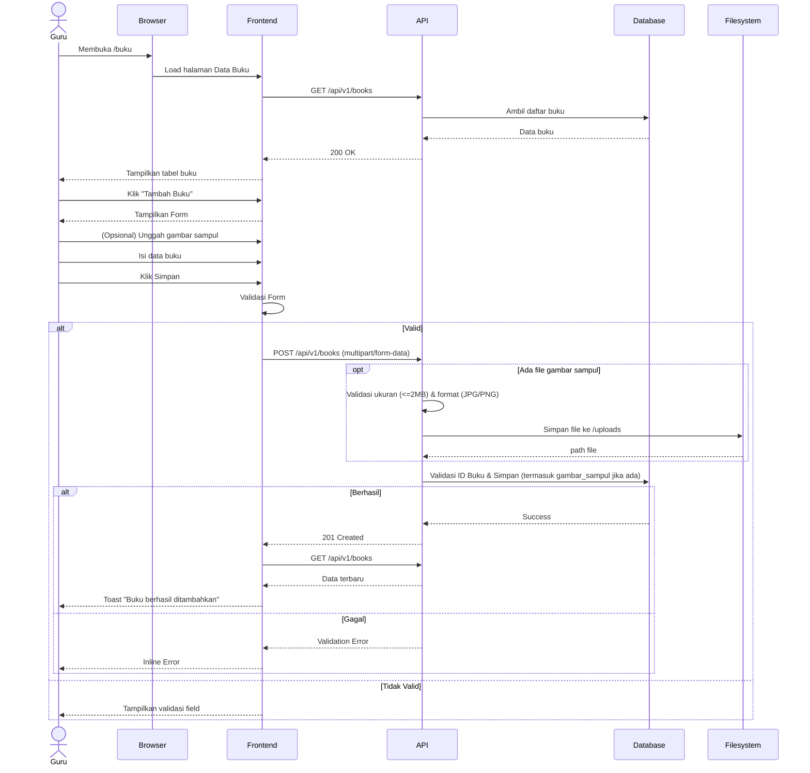

# System Logic: UC-002 Manajemen Data Buku

**Document Version:** v1.4 (Ubah tema_buku menjadi nullable enum; penyempurnaan aturan pengisian tingkat_kelas & tema_buku — sinkron data_model.md v1.5 & srs.md v3.6)

**Use Case ID:** UC-002

**Use Case Name:** Manajemen Data Buku

**Status:** Draft

**Last Updated:** 2026-07-10

**Author:** Kelompok DPSI BRAYYY

---

# 1. Overview

Dokumen ini mendefinisikan logika sistem untuk pengelolaan data buku oleh Guru, meliputi proses melihat, mencari, menambah, mengubah, dan menghapus data buku — termasuk (opsional) unggah gambar sampul — beserta validasi data, aturan bisnis, serta kontrak API.

---

# 2. Related Screens

| Page ID (IA) | Page Name | Route | Access Role |
| --- | --- | --- | --- |
| PAGE-003 | Manajemen Data Buku | `/buku` | Guru (Authenticated) |
| PAGE-003-SUB-01 | Form Tambah Buku Baru (Modal) | Modal di `/buku` | Guru (Authenticated) |
| PAGE-003-SUB-02 | Form Edit Data Buku (Modal) | Modal di `/buku` | Guru (Authenticated) |

---

# 3. Related Entities

| Entity (Data Model) | Peran dalam Use Case Ini |
| --- | --- |
| `buku` | Dibaca (GET/search), dibuat (POST), diubah (PUT), dan dihapus (DELETE) sepenuhnya oleh use case ini — termasuk kolom `gambar_sampul`. |
| `session` (tidak langsung) | Divalidasi via middleware `requireAuth` untuk memastikan hanya Guru dengan sesi aktif yang dapat mengakses endpoint. |

---

# 4. Sequence Diagram



---

# 5. API Contract

## 5.1 GET /api/v1/books

Mengambil seluruh data buku. Memerlukan sesi Guru aktif (cookie `session_id`).

### Success Response (200 OK)

```json
{
  "success": true,
  "data": [
    {
      "id_buku": "BK001",
      "judul_buku": "IPA Kelas 4",
      "penulis": "Kemendikbud",
      "penerbit": "Kemendikbud",
      "tema_buku": null,
      "tahun_terbit": 2024,
      "lokasi_rak": "A1",
      "stok": 5,
      "status_buku": "Tersedia",
      "gambar_sampul": "/uploads/buku_A1_001.jpg",
      "tingkat_kelas": 4
    }
  ],
  "message": "Success"
}
```

> `gambar_sampul` bernilai `null` jika Guru belum mengunggah sampul untuk buku tersebut.
> `tema_buku` bernilai `null` untuk buku pelajaran (yang menggunakan `tingkat_kelas`) atau buku yang tidak jelas kategorinya; diisi `"Cerita & Dongeng"` atau `"Lainnya"` untuk buku non-pelajaran.

---

## 5.2 POST /api/v1/books

Menambahkan data buku baru. Menerima `multipart/form-data` (bukan `application/json` murni) karena mendukung unggah file gambar sampul opsional.

### Request Header

| Header | Value |
|---------|-------|
| Content-Type | multipart/form-data |

### Request Body (form fields)

| Field | Tipe | Wajib | Keterangan |
| --- | --- | --- | --- |
| `id_buku` | text | Ya | Kode unik buku |
| `judul_buku` | text | Ya | — |
| `penulis` | text | Ya | — |
| `penerbit` | text | Ya | — |
| `tema_buku` | text (nullable) | **Tidak (opsional)** | Diisi hanya untuk buku non-pelajaran: `"Cerita & Dongeng"` atau `"Lainnya"`; buku pelajaran tidak perlu mengisi (`null`). |
| `tahun_terbit` | text (numeric) | Ya | — |
| `lokasi_rak` | text | Ya | Format huruf+angka, mis. "A1" |
| `stok` | text (numeric) | Ya | Integer ≥ 0 |
| `gambar_sampul` | file (JPG/PNG, maks 2MB) | **Tidak (opsional)** | Jika dikirim, disimpan ke `/uploads`; jika kosong, kolom `gambar_sampul` = NULL |
| `tingkat_kelas` | text (numeric, nullable) | **Tidak (opsional)** | Nilai 1–6 untuk buku pelajaran berjenjang; NULL untuk buku non-pelajaran. Jangan diisi bersamaan dengan `tema_buku` (mutually exclusive). |

### Success Response (201 Created)

```json
{
  "success": true,
  "data": {
    "id_buku": "BK001",
    "gambar_sampul": "/uploads/buku_A1_001.jpg"
  },
  "message": "Buku berhasil ditambahkan"
}
```

### Error Response (400 — Validasi Field Teks)

```json
{
  "success": false,
  "data": null,
  "message": "Validation Failed",
  "errors": [
    { "field": "lokasi_rak", "message": "Format lokasi rak tidak valid" }
  ]
}
```

### Error Response (400 — Gambar Sampul)

```json
{
  "success": false,
  "data": null,
  "message": "Validation Failed",
  "errors": [
    { "field": "gambar_sampul", "message": "Ukuran file melebihi 2MB. Silakan kompres gambar terlebih dahulu." }
  ]
}
```

### Error Response (409 Conflict)

```json
{
  "success": false,
  "data": null,
  "message": "ID Buku sudah digunakan",
  "errors": []
}
```

---

## 5.3 PUT /api/v1/books/{id_buku}

Mengubah data buku, termasuk mengganti/menghapus gambar sampul, mengubah tingkat_kelas, dan mengubah tema_buku. Menerima `multipart/form-data` (field sama seperti POST; kirim field kosong untuk field yang tidak diubah). Tingkat_kelas dan tema_buku bersifat opsional — ikuti pola yang sama dengan field opsional lainnya: jika tidak dikirim, nilai lama tetap dipertahankan; jika dikirim kosong, set ke NULL.

### Proses Backend (gambar sampul)

- Jika request menyertakan file baru: hapus file lama di `/uploads` (jika ada), simpan file baru, update kolom `gambar_sampul`.
- Jika request menyertakan flag eksplisit `hapus_gambar=true`: hapus file di `/uploads`, set `gambar_sampul = NULL`.
- Jika tidak ada perubahan pada field gambar: kolom `gambar_sampul` tidak disentuh.

### Success Response

```json
{
  "success": true,
  "data": null,
  "message": "Buku berhasil diubah"
}
```

---

## 5.4 DELETE /api/v1/books/{id_buku}

Menghapus data buku. Turut menghapus file `gambar_sampul` terkait dari `/uploads`, jika ada.

### Proses Backend

1. Cek `status_buku != 'Dipinjam'` — jika masih dipinjam, tolak (409).
2. `SELECT gambar_sampul FROM buku WHERE id_buku = ?`.
3. `DELETE FROM buku WHERE id_buku = ?`.
4. Jika `gambar_sampul` tidak NULL: hapus file fisik dari `/uploads` (best-effort; kegagalan hapus file tidak membatalkan DELETE record, hanya dicatat sebagai warning di log).

### Success Response

```json
{
  "success": true,
  "data": null,
  "message": "Buku berhasil dihapus"
}
```

### Error Response (409 Conflict)

```json
{
  "success": false,
  "data": null,
  "message": "Buku sedang dipinjam dan tidak dapat dihapus",
  "errors": []
}
```

---

## 5.5 GET /api/v1/books?search={keyword}

Mencari buku berdasarkan `judul_buku`, `tema_buku` (pencarian teks, meskipun tema_buku sekarang enum tertutup), atau `id_buku`.

### Success Response

Format sama seperti Section 5.1, hanya berisi baris yang cocok dengan `keyword`.

---

# 6. Data Flow

| Step | Input | Process | Output |
|------|-------|---------|--------|
| 1 | Request halaman buku | Ambil data buku | Daftar buku (termasuk `gambar_sampul` & `tingkat_kelas`) |
| 2 | Kata kunci pencarian | Filter `judul_buku`/`tema_buku`/`id_buku` | Hasil pencarian |
| 3 | Data buku baru + (opsional) file gambar + (opsional) tingkat_kelas + (opsional) tema_buku | Validasi field teks, file, tingkat_kelas, & tema_buku | Data valid |
| 4 | File gambar (jika ada) | Validasi ukuran/format, simpan ke `/uploads` | Path file |
| 5 | Data valid | Simpan ke database (`buku`) | Buku baru dengan tingkat_kelas |
| 6 | Data perubahan | Update database, kelola file lama/baru | Data terbaru |
| 7 | `id_buku` | Hapus record + file gambar terkait | Record & file terhapus |
| 8 | Refresh data | GET Books | Tabel terbaru |

---

# 7. Security Rules

| Rule | Description |
|------|-------------|
| Authentication | Seluruh endpoint memerlukan sesi Guru aktif (cookie `session_id`) |
| Authorization | Hanya Guru yang dapat mengelola data buku |
| Unique ID | `id_buku` harus unik |
| Input Validation | Semua field wajib divalidasi sebelum dikirim |
| XSS Protection | `judul_buku`, `penulis`, `lokasi_rak` disanitasi dari script berbahaya |
| Stock Validation | `stok` tidak boleh bernilai negatif |
| Rack Validation | `lokasi_rak` harus menggunakan format huruf + angka (contoh A1, B3) |
| Delete Protection | Buku dengan `status_buku = 'Dipinjam'` tidak dapat dihapus |
| Image Upload Validation | `gambar_sampul` maksimal 2MB, format JPG/PNG; file disimpan di filesystem lokal `/uploads`, bukan sebagai blob di database (`data_model.md` v1.3 BR-24) |
| Image Cleanup | File gambar lama dihapus dari `/uploads` saat diganti (PUT) atau saat buku dihapus (DELETE), mencegah file yatim menumpuk |
| Tingkat Kelas Validation | `tingkat_kelas` jika diisi harus integer 1–6, divalidasi backend; NULL diperbolehkan (buku non-pelajaran atau untuk semua kelas) |
| Tema Buku Validation | `tema_buku` jika diisi hanya boleh `"Cerita & Dongeng"` atau `"Lainnya"`; NULL diperbolehkan (buku pelajaran atau tidak jelas kategorinya) |
| Local State | Data form tetap tersimpan saat terjadi network error |
| Audit | Semua operasi CRUD dicatat pada log sistem |

---

# 8. Traceability

| Requirement (SRS v3.6) | User Flow AC-ID | API Endpoint |
|------------|-------------|--------------|
| FR-005 (form tambah buku — Tema dropdown opsional, Tingkat Kelas opsional) | AC-002-01 | POST /api/v1/books |
| FR-006 (ubah/hapus data buku) | AC-002-05, AC-002-06, AC-002-07 | PUT / DELETE /api/v1/books/{id_buku} |
| FR-007 (pencarian buku) | AC-002-08 | GET /api/v1/books?search= |
| FR-008 (tolak jika ID sudah ada) | AC-002-02 | POST /api/v1/books |
| FR-009 (tolak jika lokasi rak kosong/salah format) | AC-002-03 | POST / PUT /api/v1/books |
| Business Rule F002 (stok ≥ 0) | AC-002-04 | POST / PUT /api/v1/books |
| Business Rule F002 (hapus jika "Dipinjam" ditolak) | AC-002-06 | DELETE /api/v1/books/{id_buku} |
| AC-002-09 (upload gambar sampul opsional, validasi ukuran/format) | AC-002-09 | POST / PUT /api/v1/books |
| AC-002-10 (placeholder jika tanpa gambar) | AC-002-10 | GET /api/v1/books |
| FR-030 (field Tingkat Kelas opsional) | AC-002-11 | POST / PUT /api/v1/books |

---

# 9. Revision History

| Version | Date | Author | Description |
|---------|------------|---------------------|-------------------------------|
| 1.0 | 2026-07-01 | Kelompok DPSI BRAYYY | Initial Draft System Logic UC-002 (Bearer Token, tanpa gambar sampul, field naming belum sinkron Data Model). |
| 1.1 | 2026-07-09 | Kelompok DPSI BRAYYY | Hapus referensi Bearer Token; field naming sinkron `data_model.md` v1.3; tambah dukungan upload gambar sampul; Traceability Matrix diarahkan ke FR-ID/AC-ID sesungguhnya. |
| **1.3** | **2026-07-10** | **Kelompok DPSI BRAYYY** | **Tambah field `tingkat_kelas` pada buku:** (1) update Success Response Section 5.1; (2) tambah baris `tingkat_kelas` di Request Body POST (Section 5.2); (3) update deskripsi PUT (Section 5.3); (4) update Data Flow (Section 6); (5) tambah Security Rule "Tingkat Kelas Validation" (Section 7); (6) tambah FR-030 di Traceability (Section 8). Sinkron data_model.md v1.4 & srs.md v3.5. |
| **1.4** | **2026-07-11** | **Kelompok DPSI BRAYYY** | **Ubah `tema_buku` menjadi nullable enum:** (1) update header versi; (2) update Success Response — `tema_buku: null` + catatan; (3) update Request Body — `tema_buku` jadi opsional, nilai enum; (4) update PUT — sebut tema_buku; (5) update GET search — catatan enum; (6) update Data Flow step 3; (7) tambah Security Rule "Tema Buku Validation"; (8) update Traceability — FR-005 deskripsi dropdown opsional, header v3.6. Sinkron data_model.md v1.5 & srs.md v3.6.** |