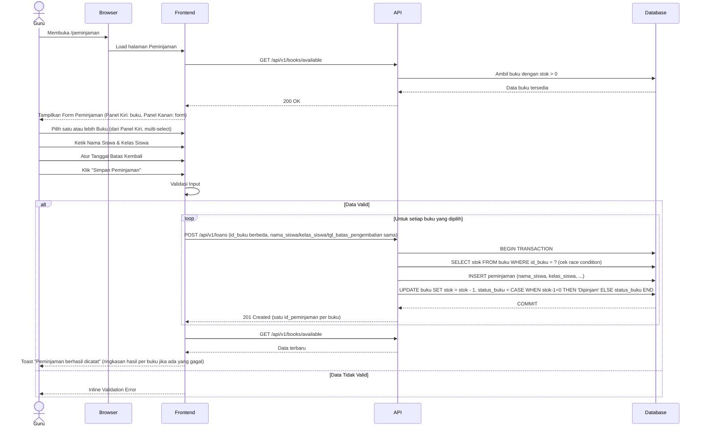

# System Logic: UC-003 Pencatatan Peminjaman Buku

**Document Version:** v1.2 (Tambah section Related Screens & Related Entities)

**Use Case ID:** UC-003

**Use Case Name:** Pencatatan Peminjaman Buku

**Status:** Draft

**Last Updated:** 2026-07-10

**Author:** Kelompok DPSI BRAYYY

---

# 1. Overview

Dokumen ini mendefinisikan logika sistem untuk proses pencatatan peminjaman buku oleh Guru. Sistem memvalidasi data buku yang tersedia serta data siswa yang *diketik manual oleh Guru* (nama dan kelas, bukan dipilih dari tabel master terpisah — lihat data_model.md v1.3 Section 2), menyimpan transaksi peminjaman, serta menjalankan sinkronisasi stok dan status buku secara otomatis (F007) dalam satu transaksi database atomik. Guru dapat memilih lebih dari satu buku sekaligus untuk siswa yang sama dalam satu submit form (Panel Kiri mendukung multi-select); dalam kasus ini, frontend memanggil POST /api/v1/loans berkali-kali secara berurutan — satu kali panggilan API per buku (lihat Section 5.2, catatan Multi-Buku) — bukan melalui endpoint batch/gabungan.

---

# 2. Related Screens

| Page ID (IA) | Page Name | Route | Access Role |
| --- | --- | --- | --- |
| PAGE-004 | Pencatatan Peminjaman Buku | `/peminjaman` | Guru (Authenticated) |

> **Catatan:** Page ID mengikuti pola penomoran `information_architecture.md` (PAGE-001 Login, PAGE-002 Beranda Publik, PAGE-003 Manajemen Data Buku); mohon dikonfirmasi ulang terhadap SoT-2 apabila penomoran aktual berbeda.

---

# 3. Related Entities

| Entity (Data Model) | Peran dalam Use Case Ini |
| --- | --- |
| `buku` | Dibaca (`stok > 0` untuk Panel Kiri); diubah (`stok`, `status_buku`) sebagai bagian transaksi atomik F007. |
| `peminjaman` | Dibuat (INSERT) — menyimpan `nama_siswa`, `kelas_siswa` sebagai teks bebas, `id_buku`, `tgl_peminjaman`, `tgl_batas_pengembalian`. |
| `session` (tidak langsung) | Divalidasi via middleware `requireAuth` untuk memastikan hanya Guru dengan sesi aktif yang dapat mencatat peminjaman. |

---

# 4. Sequence Diagram



---

# 5. API Contract

## 5.1 GET /api/v1/books/available

Mengambil daftar buku dengan `stok > 0` (buku stok 0 disembunyikan dari pilihan, sesuai FR-013).

### Success Response

```json
{
  "success": true,
  "data": [
    {
      "id_buku": "BK001",
      "judul_buku": "IPA Kelas 4",
      "penulis": "Kemendikbud",
      "tema_buku": "IPA",
      "lokasi_rak": "A1",
      "stok": 3,
      "status_buku": "Tersedia"
    }
  ],
  "message": "Success"
}
```

> **Catatan v1.1:** Endpoint `GET /api/v1/students` pada draft v1.0 **dihapus**. Tidak ada tabel master siswa — Guru mengetik `nama_siswa` dan `kelas_siswa` langsung sebagai teks bebas saat mengisi form peminjaman.

---

## 5.2 POST /api/v1/loans

Mencatat transaksi peminjaman buku.

### Request Header

| Header | Value |
|---------|-------|
| Content-Type | application/json |

### Request Body

```json
{
  "id_buku": "BK001",
  "nama_siswa": "Budi Santoso",
  "kelas_siswa": "4A",
  "tgl_batas_pengembalian": "2026-07-08"
}
```

> *Catatan v1.1:* Tidak ada field id_siswa (integer FK) seperti draft v1.0 — diganti nama_siswa dan kelas_siswa (teks bebas), sesuai data_model.md v1.3 tabel peminjaman. Field tanggal_pinjam juga *tidak dikirim dari frontend* — backend mengisi otomatis tgl_peminjaman = date('now') (FR-011, immutable).
>
> *Catatan Multi-Buku:* Endpoint ini menerima *satu id_buku per panggilan, tidak ada array/batch. Ketika Guru memilih lebih dari satu buku dalam satu submit form, frontend memanggil endpoint ini **berkali-kali secara berurutan* — satu kali panggilan per buku, masing-masing dengan id_buku berbeda tapi nama_siswa, kelas_siswa, dan tgl_batas_pengembalian yang sama. Setiap panggilan menghasilkan satu id_peminjaman independen. Backend tidak perlu tahu bahwa beberapa panggilan berasal dari satu submit form yang sama — pengelompokan "buku-buku yang dipinjam bersamaan" untuk kebutuhan tampilan (mis. Panel Peminjaman Aktif, Modal Konfirmasi Pengembalian) dilakukan di level query GET, berdasarkan kombinasi nama_siswa + tgl_peminjaman + tgl_batas_pengembalian yang sama (lihat data_model.md v1.6 Section 3.3).

### Success Response (201 Created)

```json
{
  "success": true,
  "data": {
    "id_peminjaman": "PJ00001",
    "tgl_peminjaman": "2026-07-09",
    "status_peminjaman": "Dipinjam"
  },
  "message": "Peminjaman berhasil dicatat"
}
```

### Error Response (400 Bad Request)

```json
{
  "success": false,
  "data": null,
  "message": "Validation Failed",
  "errors": [
    { "field": "tgl_batas_pengembalian", "message": "Tanggal batas pengembalian tidak boleh sebelum tanggal peminjaman" },
    { "field": "nama_siswa", "message": "Nama siswa mengandung karakter yang tidak diperbolehkan" }
  ]
}
```

### Error Response (409 Conflict)

```json
{
  "success": false,
  "data": null,
  "message": "Buku ini sudah tidak tersedia. Silakan pilih buku lain.",
  "errors": []
}
```

> Dipicu ketika `stok` buku sudah 0 saat transaksi hendak disimpan (race condition — mis. dua peminjaman diproses berurutan sangat cepat), sesuai EF-004 `userflow_uc_003.md`.

### Error Response (500 Internal Server Error)

```json
{
  "success": false,
  "data": null,
  "message": "Terjadi kesalahan server",
  "errors": []
}
```

---

# 6. Data Flow

| Step | Input | Process | Output |
|------|-------|---------|--------|
| 1 | Request halaman | Ambil buku dengan stok > 0 | Daftar buku untuk Panel Kiri |
| 2 | Pilihan buku | Tampilkan detail (Lokasi Rak, dsb.) di Panel Kanan | Detail buku |
| 3 | Nama Siswa, Kelas Siswa, Tanggal Batas Kembali | Validasi input & tanggal | Request siap dikirim |
| 4 | Request POST (diulang per buku jika multi-buku) | Cek stok ulang (race condition), simpan transaksi peminjaman | Data peminjaman (satu baris per buku) |
| 5 | Data peminjaman | Kurangi stok buku | Stok terbaru |
| 6 | Stok terbaru | Update status buku jika stok = 0 | Status Dipinjam |
| 7 | Commit transaksi | Refresh data | Form siap digunakan kembali |

---

# 7. Security Rules

| Rule | Description |
|------|-------------|
| Authentication | Seluruh endpoint memerlukan sesi Guru aktif (cookie `session_id`) |
| Authorization | Hanya Guru yang dapat mencatat peminjaman |
| Input Validation | Seluruh field wajib diisi (`id_buku`, `nama_siswa`, `kelas_siswa`, `tgl_batas_pengembalian`) |
| Date Validation | `tgl_batas_pengembalian` ≥ `tgl_peminjaman` (divalidasi ulang di backend meski frontend sudah menerapkan constraint `min` pada Date Picker) |
| Immutable Date | `tgl_peminjaman` diisi otomatis oleh server (`date('now')`), tidak menerima input dari client |
| Stock Validation | Buku hanya dapat dipinjam jika `stok > 0`, dicek ulang di dalam transaksi (menghindari race condition) |
| Atomic Transaction | INSERT `peminjaman`, UPDATE `buku.stok`/`status_buku` dilakukan dalam satu transaksi database |
| Rollback | Jika salah satu proses gagal maka seluruh transaksi dibatalkan |
| XSS Protection | `nama_siswa`, `kelas_siswa` disanitasi dari karakter berbahaya |
| Local State | Form tetap tersimpan ketika terjadi network error |
| Audit Log | Seluruh transaksi peminjaman dicatat ke log sistem |

---

# 8. Traceability

| Requirement (SRS v3.4) | User Flow AC-ID | API Endpoint |
|------------|-------------|--------------|
| FR-010 (form peminjaman: pilihan buku, nama & kelas siswa) | AC-003-01 | GET /api/v1/books/available; POST /api/v1/loans |
| FR-011 (tanggal pinjam otomatis) | AC-003-03 | POST /api/v1/loans (server-side) |
| FR-012 (tanggal batas kembali diatur Guru) | AC-003-04 | POST /api/v1/loans |
| FR-013 (sembunyikan buku stok 0) | AC-003-02 | GET /api/v1/books/available |
| FR-014 (update stok/status segera setelah simpan) | AC-003-05 | Database Transaction |
| Business Rule F003 (satu eksemplar per transaksi) | AC-003-01 | POST /api/v1/loans |
| Business Rule F007 (transaksi atomik) | AC-003-05 | Database Transaction |
| — (data form tidak hilang saat gagal) | AC-003-06 | Frontend Local State |
| Business Rule F003 (Guru dapat memilih >1 buku sekaligus, setiap buku transaksi independen) | AC-003-07 | POST /api/v1/loans (dipanggil berkali-kali) |

---

# 9. Revision History

| Version | Date | Author | Description |
|---------|------------|----------------------|--------------------------------|
| 1.0 | 2026-07-01 | Kelompok DPSI BRAYYY | Initial Draft System Logic UC-003 — mengasumsikan tabel master `siswa` dengan endpoint `GET /api/v1/students` dan `id_siswa` (integer FK), bertentangan dengan `data_model.md`. |
| 1.1 | 2026-07-09 | Kelompok DPSI BRAYYY | Perbaikan: (1) hapus endpoint `GET /api/v1/students` dan field `id_siswa`, diganti `nama_siswa`/`kelas_siswa` teks bebas sesuai `data_model.md` v1.3; (2) hapus referensi Bearer Token, ganti otentikasi via cookie sesi; (3) field naming diselaraskan Data Model (`judul_buku`, `tgl_peminjaman`, `tgl_batas_pengembalian`, dst.); (4) tambah langkah pengecekan ulang stok di dalam transaksi database untuk menangani race condition (EF-004 UF); (5) Traceability Matrix diarahkan ke FR-ID dan AC-ID sesungguhnya. |
| **1.2** | **2026-07-10** | **Kelompok DPSI BRAYYY** | **Tambah Section 2 (Related Screens) dan Section 3 (Related Entities) sesuai checklist minimal isi UCIC, menyamakan struktur dengan sys_uc_001.md dan sys_uc_002.md; section lain digeser penomorannya (Sequence Diagram jadi Section 4, dst.).** |