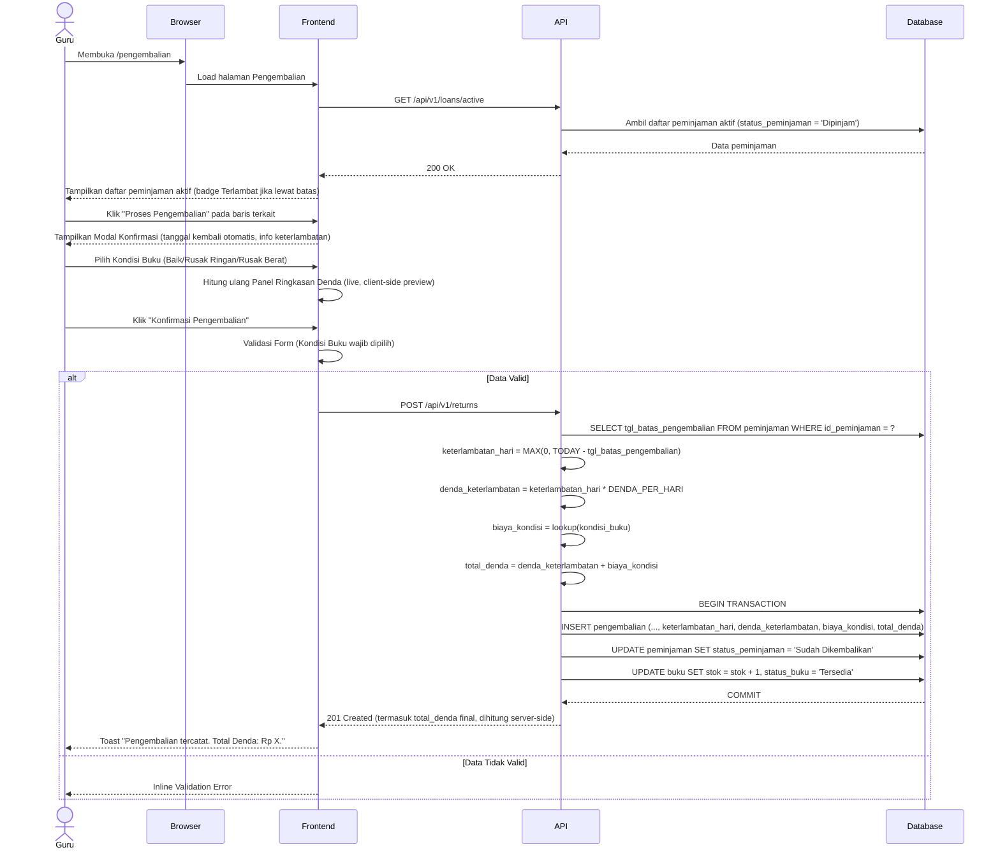

# System Logic: UC-004 Pencatatan Pengembalian Buku

**Document Version:** v1.2 (Tambah section Related Screens & Related Entities)

**Use Case ID:** UC-004

**Use Case Name:** Pencatatan Pengembalian Buku

**Status:** Draft

**Last Updated:** 2026-07-10

**Author:** Kelompok DPSI BRAYYY

---

# 1. Overview

Dokumen ini mendefinisikan logika sistem untuk proses pencatatan pengembalian buku oleh Guru. Sistem memvalidasi data peminjaman yang masih aktif, menghitung keterlambatan **dan nominal denda** secara otomatis (F004, `srs.md` v3.4 Business Rule F004), menyimpan data pengembalian, serta memperbarui stok dan status buku dalam satu transaksi database atomik (F007). Status buku setelah pengembalian **selalu** kembali menjadi `'Tersedia'`, terlepas dari kondisi fisik buku — perubahan status menjadi `'Tidak Aktif'` hanya dapat dilakukan Guru secara manual melalui F002 (Manajemen Data Buku), bukan otomatis saat pengembalian.

---

# 2. Related Screens

| Page ID (IA) | Page Name | Route | Access Role |
| --- | --- | --- | --- |
| PAGE-005 | Pencatatan Pengembalian Buku | `/pengembalian` | Guru (Authenticated) |
| PAGE-005-SUB-01 | Modal Konfirmasi Pengembalian | Modal di `/pengembalian` | Guru (Authenticated) |

> **Catatan:** Page ID mengikuti pola penomoran `information_architecture.md`; mohon dikonfirmasi ulang terhadap SoT-2 apabila penomoran aktual berbeda.

---

# 3. Related Entities

| Entity (Data Model) | Peran dalam Use Case Ini |
| --- | --- |
| `peminjaman` | Dibaca (daftar aktif `status_peminjaman = 'Dipinjam'`); diubah (`status_peminjaman` → `'Sudah Dikembalikan'`). |
| `pengembalian` | Dibuat (INSERT) — menyimpan `kondisi_buku`, `keterlambatan_hari`, `denda_keterlambatan`, `biaya_kondisi`, `total_denda`, bersifat immutable setelah tersimpan. |
| `buku` | Diubah (`stok`, `status_buku`) sebagai bagian transaksi atomik F007. |
| `session` (tidak langsung) | Divalidasi via middleware `requireAuth` untuk memastikan hanya Guru dengan sesi aktif yang dapat mencatat pengembalian. |

---

# 4. Sequence Diagram



> **Catatan v1.1:** Nominal denda yang ditampilkan di Panel Ringkasan Denda (frontend, sebelum submit) bersifat **preview client-side** untuk kenyamanan Guru. Nilai yang benar-benar tersimpan dan bersifat immutable adalah hasil kalkulasi **server-side** pada `POST /api/v1/returns`, mengikuti prinsip "jangan pernah mempercayai kalkulasi finansial dari client".

---

# 5. API Contract

## 5.1 GET /api/v1/loans/active

Mengambil daftar transaksi peminjaman yang belum dikembalikan (`status_peminjaman = 'Dipinjam'`).

### Success Response

```json
{
  "success": true,
  "data": [
    {
      "id_peminjaman": "PJ00001",
      "nama_siswa": "Budi Santoso",
      "kelas_siswa": "4A",
      "judul_buku": "IPA Kelas 4",
      "tgl_peminjaman": "2026-07-01",
      "tgl_batas_pengembalian": "2026-07-08",
      "hari_terlambat_saat_ini": 1
    }
  ],
  "message": "Success"
}
```

> `hari_terlambat_saat_ini` adalah nilai *live* (dihitung terhadap tanggal hari ini saat GET dipanggil, bukan nilai final) — dipakai untuk badge "Terlambat" pada tabel. Nilai final `keterlambatan_hari` yang tersimpan hanya dihitung sekali saat `POST /api/v1/returns` dipanggil.

---

## 5.2 POST /api/v1/returns

Mencatat pengembalian buku beserta kalkulasi denda otomatis.

### Request Header

| Header | Value |
|---------|-------|
| Content-Type | application/json |

### Request Body

```json
{
  "id_peminjaman": "PJ00001",
  "kondisi_buku": "Rusak Ringan"
}
```

> **Catatan v1.1:** Request **tidak** menyertakan `tanggal_kembali` (server mengisi otomatis `tgl_pengembalian = date('now')`, FR-017, immutable) maupun nominal denda apa pun — seluruh kalkulasi denda wajib dilakukan di backend, bukan diterima dari client (mencegah manipulasi nominal via request tercurangi).

### Success Response (201 Created)

```json
{
  "success": true,
  "data": {
    "id_pengembalian": "PG00001",
    "tgl_pengembalian": "2026-07-09",
    "keterlambatan_hari": 1,
    "denda_keterlambatan": 500,
    "biaya_kondisi": 2000,
    "total_denda": 2500,
    "status_peminjaman": "Sudah Dikembalikan",
    "status_buku": "Tersedia"
  },
  "message": "Pengembalian berhasil dicatat"
}
```

> **Catatan v1.1:** `status_buku` **selalu** `"Tersedia"` pada response ini, tanpa memandang `kondisi_buku` — lihat Section 6 (Security Rules) soal penghapusan business rule "Rusak Berat → Tidak Aktif" yang ada di draft v1.0.

### Error Response (400 Bad Request)

```json
{
  "success": false,
  "data": null,
  "message": "Validation Failed",
  "errors": [
    { "field": "kondisi_buku", "message": "Silakan pilih kondisi buku" }
  ]
}
```

### Error Response (409 Conflict)

```json
{
  "success": false,
  "data": null,
  "message": "Peminjaman sudah dikembalikan sebelumnya",
  "errors": []
}
```

### Error Response (500 Internal Server Error)

```json
{
  "success": false,
  "data": null,
  "message": "Terjadi kesalahan server",
  "errors": []
}
```

---

## 5.3 GET /api/v1/config/denda *(Baru v1.1)*

Mengambil konstanta nominal denda saat ini, dipakai frontend untuk menghitung **preview** Panel Ringkasan Denda secara live sebelum submit (Section 2, catatan di bawah sequence diagram).

### Success Response

```json
{
  "success": true,
  "data": {
    "denda_per_hari": 500,
    "denda_rusak_ringan": 2000,
    "denda_rusak_berat": 5000
  },
  "message": "Success"
}
```

> Nilai ini bersumber dari konfigurasi backend (`data_model.md` v1.3 Section 3.7: `.env` / `denda.config.js`), bukan hardcode di frontend — jika nominal diubah pihak sekolah, frontend otomatis ikut menyesuaikan tanpa perlu rebuild.

---

# 6. Data Flow

| Step | Input | Process | Output |
|------|-------|---------|--------|
| 1 | Request halaman | Ambil daftar peminjaman aktif | Data peminjaman + indikator keterlambatan live |
| 2 | Klik "Proses Pengembalian" | Ambil detail peminjaman | Data ditampilkan di modal |
| 3 | Kondisi Buku dipilih (frontend) | Preview kalkulasi denda client-side (pakai `GET /api/v1/config/denda`) | Panel Ringkasan Denda (preview) |
| 4 | Request POST `/returns` | **Kalkulasi ulang di server**: `keterlambatan_hari`, `denda_keterlambatan`, `biaya_kondisi`, `total_denda` | Nilai final tersimpan |
| 5 | Data valid | Simpan data pengembalian (INSERT) | Data pengembalian |
| 6 | Data pengembalian | Tambah stok buku (+1) | Stok terbaru |
| 7 | — | Update status buku → `'Tersedia'` (selalu, tanpa pengecualian kondisi) | Status Tersedia |
| 8 | Commit transaksi | Refresh data | Daftar peminjaman aktif diperbarui, riwayat menampilkan Total Denda |

---

# 7. Security Rules

| Rule | Description |
|------|-------------|
| Authentication | Seluruh endpoint memerlukan sesi Guru aktif (cookie `session_id`) |
| Authorization | Hanya Guru yang dapat mencatat pengembalian |
| Input Validation | Kondisi buku wajib dipilih |
| Date Immutability | `tgl_pengembalian` diisi otomatis oleh server (`date('now')`), tidak menerima input dari client |
| Server-Side Denda Calculation | `keterlambatan_hari`, `denda_keterlambatan`, `biaya_kondisi`, `total_denda` wajib dihitung 100% di backend dari data `peminjaman.tgl_batas_pengembalian` dan konstanta konfigurasi — tidak menerima nilai denda apa pun dari request body client |
| Denda Immutability | Setelah `INSERT pengembalian` berhasil, tidak ada endpoint UPDATE untuk kolom denda maupun kondisi buku — koreksi hanya oleh administrator langsung ke file database SQLite |
| Atomic Transaction | INSERT `pengembalian`, UPDATE `peminjaman.status_peminjaman`, UPDATE `buku.stok`/`status_buku` dilakukan dalam satu transaksi database |
| Rollback | Jika salah satu proses gagal maka seluruh transaksi dibatalkan |
| Duplicate Protection | Satu `id_peminjaman` hanya dapat dikembalikan satu kali (`UNIQUE` constraint `pengembalian.id_peminjaman`) |
| ~~Kondisi "Rusak Berat" → status "Tidak Aktif" otomatis~~ (Dihapus v1.1) | Business rule ini ada di draft v1.0 namun tidak berdasar `srs.md` manapun. Status buku setelah pengembalian selalu `'Tersedia'`, tanpa pengecualian kondisi. Jika Guru ingin menarik buku dari sirkulasi karena rusak berat, itu keputusan manual terpisah via F002 (Manajemen Data Buku), bukan efek samping otomatis dari F004. |
| XSS Protection | — (tidak ada input teks bebas pada endpoint ini selain `kondisi_buku` yang bersifat enum tertutup) |
| Local State | Modal tetap terbuka dengan pilihan kondisi buku tidak hilang ketika terjadi network error |
| Audit Log | Seluruh transaksi pengembalian (termasuk nominal denda) dicatat pada log sistem |

---

# 8. Traceability

| Requirement (SRS v3.4) | User Flow AC-ID | API Endpoint |
|------------|-------------|--------------|
| FR-015 (form pengembalian terhubung ID Peminjaman) | AC-004-01 | GET /api/v1/loans/active; POST /api/v1/returns |
| FR-016 (pilihan kondisi buku) | AC-004-04 | POST /api/v1/returns |
| FR-017 (tanggal pengembalian otomatis) | AC-004-02 | POST /api/v1/returns (server-side) |
| FR-018 (hitung & tampilkan hari keterlambatan) | AC-004-03 | GET /api/v1/loans/active; POST /api/v1/returns |
| FR-019 (hitung & tampilkan Total Denda otomatis sebelum konfirmasi) | AC-004-05, AC-004-06 | GET /api/v1/config/denda (preview); POST /api/v1/returns (final) |
| FR-020 (update stok/status segera setelah simpan) | AC-004-07 | Database Transaction |
| Business Rule F004 (formula denda: Rp 500/hari + biaya kondisi) | AC-004-05 | POST /api/v1/returns |
| Business Rule F004 (denda immutable setelah tersimpan) | AC-004-09 | Tidak ada endpoint UPDATE pada `pengembalian` |
| Business Rule F004 (data pengembalian terpisah, terhubung via id_peminjaman) | AC-004-08 | POST /api/v1/returns |
| Business Rule F007 (transaksi atomik) | AC-004-07 | Database Transaction |

---

# 9. Revision History

| Version | Date | Author | Description |
|---------|------------|----------------------|--------------------------------|
| 1.0 | 2026-07-01 | Kelompok DPSI BRAYYY | Initial Draft System Logic UC-004 — **tanpa logika denda sama sekali**, dan menyertakan business rule "Rusak Berat → status Tidak Aktif otomatis" yang tidak berdasar SRS manapun. |
| 1.1 | 2026-07-09 | Kelompok DPSI BRAYYY | Perbaikan kritis: (1) tambah kalkulasi Denda Keterlambatan penuh (`keterlambatan_hari`, `denda_keterlambatan`, `biaya_kondisi`, `total_denda`) di sequence diagram, request/response `POST /api/v1/returns`, Data Flow, dan Security Rules; (2) tambah endpoint baru `GET /api/v1/config/denda` untuk preview live di frontend; (3) hapus business rule "Rusak Berat → Tidak Aktif otomatis" — status buku setelah pengembalian selalu `'Tersedia'`; (4) tegaskan prinsip kalkulasi denda 100% server-side, tidak menerima nilai dari client; (5) hapus referensi Bearer Token, ganti otentikasi via cookie sesi; (6) field naming diselaraskan `data_model.md` v1.3; (7) Traceability Matrix diarahkan ke FR-ID dan AC-ID sesungguhnya (termasuk AC-004-05, 06, 09 yang baru ditambahkan di `userflow_uc_004.md` v1.1). |
| **1.2** | **2026-07-10** | **Kelompok DPSI BRAYYY** | **Tambah Section 2 (Related Screens) dan Section 3 (Related Entities) sesuai checklist minimal isi UCIC, menyamakan struktur dengan sys_uc_001.md–sys_uc_003.md; section lain digeser penomorannya (Sequence Diagram jadi Section 4, dst.).** |