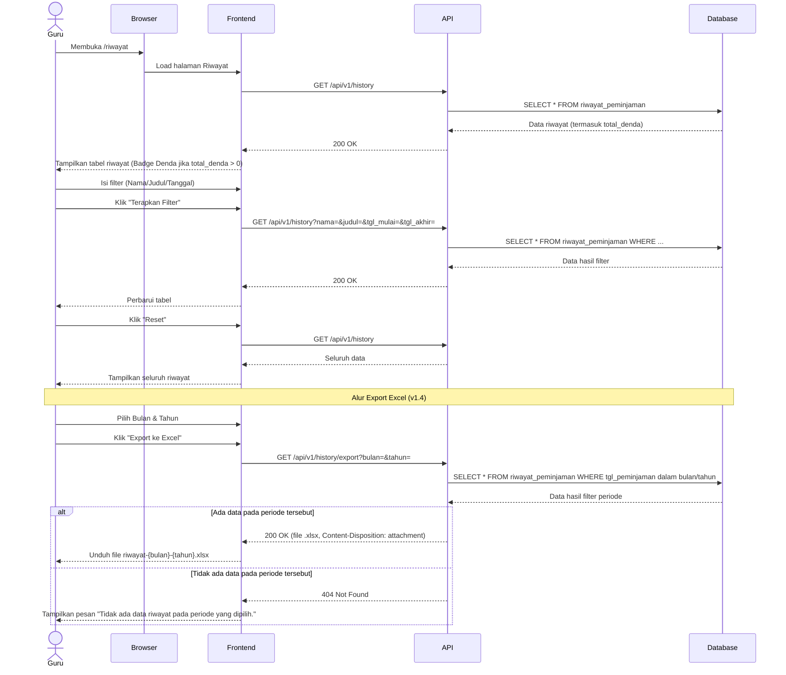

# System Logic: UC-005 Riwayat Peminjaman

**Document Version:** v1.4 (Tambah alur Export Excel pada Sequence Diagram — Section 4; sinkron dengan Section 5.3 dan Traceability FR-032 yang sebelumnya belum tergambar di sequence)

**Use Case ID:** UC-005

**Use Case Name:** Riwayat Peminjaman

**Status:** Draft

**Last Updated:** 2026-07-16

**Author:** Kelompok DPSI BRAYYY

---

# 1. Overview

Dokumen ini mendefinisikan logika sistem untuk menampilkan riwayat transaksi peminjaman dan pengembalian buku — **termasuk nominal denda yang sudah tercatat** (sinkron `design_system.md` v1.5 Section 9.5, Badge Denda). Guru dapat melihat seluruh riwayat secara kronologis, melakukan pencarian berdasarkan nama siswa, judul buku, maupun rentang tanggal, serta mengekspor riwayat ke format Excel berdasarkan bulan dan tahun. Seluruh data (termasuk nominal denda) bersifat **read-only** — sesuai dengan VIEW `riwayat_peminjaman` pada `data_model.md` v1.3, yang tidak mendukung operasi tulis apa pun.

---

# 2. Related Screens

| Page ID (IA) | Page Name | Route | Access Role |
| --- | --- | --- | --- |
| PAGE-006 | Riwayat Peminjaman | `/riwayat` | Guru (Authenticated) |

> **Catatan:** Page ID mengikuti pola penomoran `information_architecture.md`; mohon dikonfirmasi ulang terhadap SoT-2 apabila penomoran aktual berbeda.

---

# 3. Related Entities

| Entity (Data Model) | Peran dalam Use Case Ini |
| --- | --- |
| `riwayat_peminjaman` (VIEW) | Dibaca (SELECT) sepenuhnya read-only; menggabungkan data `peminjaman`, `buku`, dan `pengembalian` (termasuk `total_denda`). Digunakan baik untuk tampilan tabel maupun sebagai sumber data file export Excel. |
| `session` (tidak langsung) | Divalidasi via middleware `requireAuth` untuk memastikan hanya Guru dengan sesi aktif yang dapat melihat riwayat maupun mengekspor ke Excel. |

---

# 4. Sequence Diagram



---

# 5. API Contract

## 5.1 GET /api/v1/history

Mengambil seluruh riwayat transaksi peminjaman dan pengembalian dari VIEW `riwayat_peminjaman` (read-only).

### Success Response (200 OK)

```json
{
  "success": true,
  "data": [
    {
      "id_peminjaman": "PJ00001",
      "nama_siswa": "Budi Santoso",
      "kelas_siswa": "4A",
      "judul_buku": "IPA Kelas 4",
      "tgl_peminjaman": "2026-07-01",
      "tgl_batas_pengembalian": "2026-07-08",
      "tgl_pengembalian": "2026-07-09",
      "kondisi_buku": "Rusak Ringan",
      "keterlambatan_hari": 1,
      "total_denda": 2500,
      "status_peminjaman": "Sudah Dikembalikan"
    },
    {
      "id_peminjaman": "PJ00002",
      "nama_siswa": "Sari Dewi",
      "kelas_siswa": "5B",
      "judul_buku": "Matematika Kelas 5",
      "tgl_peminjaman": "2026-07-05",
      "tgl_batas_pengembalian": "2026-07-12",
      "tgl_pengembalian": null,
      "kondisi_buku": null,
      "keterlambatan_hari": null,
      "total_denda": null,
      "status_peminjaman": "Dipinjam"
    }
  ],
  "message": "Success"
}
```

> **Catatan v1.1:** `status_peminjaman` menggunakan enum `'Dipinjam'` / `'Sudah Dikembalikan'` — persis sesuai `data_model.md` v1.3, bukan `"Dikembalikan"` seperti draft v1.0. `total_denda` bernilai `null` jika transaksi belum dikembalikan; `0` jika sudah dikembalikan tanpa denda (tepat waktu, kondisi Baik); atau nominal Rupiah jika ada denda. Frontend menampilkan Badge Denda hanya jika `total_denda > 0` (AF-003 `userflow_uc_005.md` — strip `"—"` jika `0`/`null`).
>
> **Catatan v1.4:** Badge status pada UI menampilkan label singkat "Dikembalikan" untuk nilai `"Sudah Dikembalikan"` — ini murni penyingkatan tampilan pada komponen Badge, bukan perubahan pada enum API. Response API tetap mengirim nilai penuh `"Sudah Dikembalikan"` sesuai kontrak di atas.

---

## 5.2 GET /api/v1/history?nama={..}&judul={..}&tgl_mulai={..}&tgl_akhir={..}

Mengambil riwayat berdasarkan filter. **(Direvisi v1.1)** Digabung menjadi satu endpoint dengan query parameter opsional (bukan endpoint terpisah `/history/search`), agar konsisten dengan pola filtering di `GET /api/v1/books?search=` (UC-002).

### Query Parameter

| Parameter | Required | Description |
|-----------|----------|-------------|
| `nama` | No | Filter `LIKE %keyword%` pada `nama_siswa` |
| `judul` | No | Filter `LIKE %keyword%` pada `judul_buku` |
| `tgl_mulai` | No | Awal periode (filter pada `tgl_peminjaman`) |
| `tgl_akhir` | No | Akhir periode (filter pada `tgl_peminjaman`) |

### Example

```text
GET /api/v1/history?nama=Budi&judul=IPA
```

### Success Response

Format sama seperti Section 5.1, hanya berisi baris yang cocok dengan filter.

### Error Response (400 Bad Request)

```json
{
  "success": false,
  "data": null,
  "message": "Rentang tanggal tidak valid",
  "errors": [
    { "field": "tgl_akhir", "message": "Tanggal akhir tidak boleh lebih kecil dari tanggal mulai" }
  ]
}
```

---

## 5.3 GET /api/v1/history/export?bulan={1-12}&tahun={yyyy}

Menghasilkan file Excel (.xlsx) berisi riwayat peminjaman untuk bulan dan tahun tertentu. Memerlukan sesi Guru aktif (cookie `session_id`).

### Request Header

| Header | Value |
|--------|-------|
| Cookie | session_id=... |

### Query Parameter

| Parameter | Required | Description |
|-----------|----------|-------------|
| `bulan` | Ya | Angka 1–12 (bulan) |
| `tahun` | Ya | Tahun 4 digit (contoh: 2026) |

### Success Response (200)

- **Content-Type:** `application/vnd.openxmlformats-officedocument.spreadsheetml.sheet`
- **Content-Disposition:** `attachment; filename="riwayat-{bulan}-{tahun}.xlsx"`
- Body: file binary `.xlsx`

Kolom dalam file Excel (sesuai urutan tabel Riwayat):
Nama Siswa, Kelas, Judul Buku, Tgl Pinjam, Batas Kembali, Tgl Kembali Aktual, Kondisi Buku, Denda, Status.

Data diambil dari VIEW `riwayat_peminjaman`, difilter berdasarkan `tgl_peminjaman` yang jatuh dalam bulan/tahun yang dipilih.

### Error Response (400 Bad Request)

```json
{
  "success": false,
  "data": null,
  "message": "Parameter bulan dan tahun wajib diisi",
  "errors": []
}
```

### Error Response (404 Not Found)

```json
{
  "success": false,
  "data": null,
  "message": "Tidak ada data riwayat pada periode yang dipilih.",
  "errors": []
}
```

---

# 6. Data Flow

| Step | Input | Process | Output |
|------|-------|---------|--------|
| 1 | Request halaman | `SELECT * FROM riwayat_peminjaman` | Daftar riwayat (termasuk `total_denda`) |
| 2 | Nama siswa | Filter `nama_siswa LIKE ?` | Data sesuai nama |
| 3 | Judul buku | Filter `judul_buku LIKE ?` | Data sesuai judul |
| 4 | Rentang tanggal | Filter `tgl_peminjaman BETWEEN ? AND ?` | Data sesuai periode |
| 5 | Tombol Reset | Hapus seluruh filter | Seluruh data ditampilkan kembali |
| 6 | Bulan & Tahun + klik "Export ke Excel" | `SELECT * FROM riwayat_peminjaman WHERE tgl_peminjaman` dalam bulan/tahun terpilih, lalu digenerate menjadi file `.xlsx` | Unduhan file `riwayat-{bulan}-{tahun}.xlsx`, atau pesan "Tidak ada data" jika periode kosong |

---

# 7. Security Rules

| Rule | Description |
|------|--------------|
| Authentication | Seluruh endpoint memerlukan sesi Guru aktif (cookie `session_id`), termasuk endpoint export |
| Authorization | Hanya Guru yang dapat melihat riwayat maupun mengekspor ke Excel |
| Read Only | Tidak tersedia operasi Create, Update, maupun Delete — bersumber dari VIEW `riwayat_peminjaman`, bukan tabel langsung |
| Denda Read-Only | `total_denda` yang tampil di riwayat maupun di file export murni hasil SELECT dari kolom immutable `pengembalian.total_denda` — tidak ada endpoint yang dapat mengubahnya dari halaman ini |
| SQL Injection Protection | Seluruh parameter filter (termasuk `bulan`/`tahun` pada export) menggunakan prepared statement |
| Date Validation | `tgl_akhir` tidak boleh lebih kecil dari `tgl_mulai` |
| Local State | Filter tetap tersimpan ketika terjadi network error |
| Pagination | Riwayat ditampilkan bertahap apabila data sangat banyak |
| Audit Log | Aktivitas pencarian riwayat dapat dicatat oleh sistem |

---

# 8. Traceability

| Requirement (SRS v3.4) | User Flow AC-ID | API Endpoint |
|------------|-------------|--------------|
| FR-021 (tampilkan seluruh riwayat kronologis) | AC-005-01 | GET /api/v1/history |
| FR-022 (pencarian riwayat: nama/judul/rentang tanggal) | AC-005-02 | GET /api/v1/history?nama=&judul=&tgl_mulai=&tgl_akhir= |
| FR-023 (status transaksi: Dipinjam/Dikembalikan/Terlambat) | AC-005-03 | GET /api/v1/history |
| Business Rule F005 (data read-only) | AC-005-04 | VIEW riwayat_peminjaman (tidak ada endpoint tulis) |
| AC-005-06 (Badge Denda tampil jika total_denda > 0) | AC-005-06 | GET /api/v1/history |
| AC-005-07 (strip "—" jika total_denda = 0/null) | AC-005-07 | GET /api/v1/history |
| FR-032 (export riwayat ke Excel, filter bulan/tahun) | AC-005-08, AC-005-09 | GET /api/v1/history/export?bulan=&tahun= |

---

# 9. Revision History

| Version | Date | Author | Description |
|---------|------------|----------------------|--------------------------------|
| 1.0 | 2026-07-01 | Kelompok DPSI BRAYYY | Initial Draft System Logic UC-005 — belum ada field denda, enum status tidak sinkron Data Model (`"Dikembalikan"` alih-alih `"Sudah Dikembalikan"`), endpoint search terpisah dari endpoint utama. |
| 1.1 | 2026-07-09 | Kelompok DPSI BRAYYY | Perbaikan: (1) tambah field `total_denda` pada response, sinkron Badge Denda `design_system.md` v1.5; (2) perbaiki enum `status_peminjaman` menjadi `'Dipinjam'`/`'Sudah Dikembalikan'` sesuai `data_model.md` v1.3; (3) gabung endpoint `/history/search` ke dalam `/history` dengan query parameter opsional, konsisten dengan pola UC-002; (4) hapus referensi Bearer Token, ganti otentikasi via cookie sesi; (5) field naming diselaraskan Data Model; (6) Traceability Matrix diarahkan ke FR-ID dan AC-ID sesungguhnya, termasuk AC-005-06/07 yang baru ditambahkan di `userflow_uc_005.md` v1.1. |
| 1.2 | 2026-07-10 | Kelompok DPSI BRAYYY | Tambah Section 2 (Related Screens) dan Section 3 (Related Entities) sesuai checklist minimal isi UCIC, menyamakan struktur dengan sys_uc_001.md–sys_uc_004.md; section lain digeser penomorannya (Sequence Diagram jadi Section 4, dst.). |
| 1.3 | 2026-07-11 | Kelompok DPSI BRAYYY | Tambah endpoint export Excel (Section 5.3 — GET /api/v1/history/export?bulan=&tahun=): (1) query params bulan (1–12) dan tahun (yyyy) wajib; (2) query VIEW riwayat_peminjaman filter tgl_peminjaman; (3) sukses → unduh .xlsx, 404 jika tidak ada data; (4) update Traceability (Section 8) — FR-032, AC-005-08, AC-005-09. Sinkron dengan srs.md v3.7 & userflow_uc_005.md v1.2. |
| **1.4** | **2026-07-16** | **Kelompok DPSI BRAYYY** | **Tambah alur Export Excel pada Sequence Diagram (Section 4), yang sebelumnya belum tergambar meskipun API Contract (Section 5.3) dan Traceability (Section 8, FR-032) sudah didokumentasikan sejak v1.3. Sequence baru mencakup: pemilihan Bulan/Tahun, permintaan `GET /api/v1/history/export`, dan percabangan hasil (200 unduh file vs 404 tidak ada data). Tambah Step 6 pada Section 6 (Data Flow). Tambah catatan pada Section 5.1 mengklarifikasi bahwa label Badge "Dikembalikan" pada UI adalah penyingkatan tampilan, bukan perubahan enum API dari `"Sudah Dikembalikan"`.** |