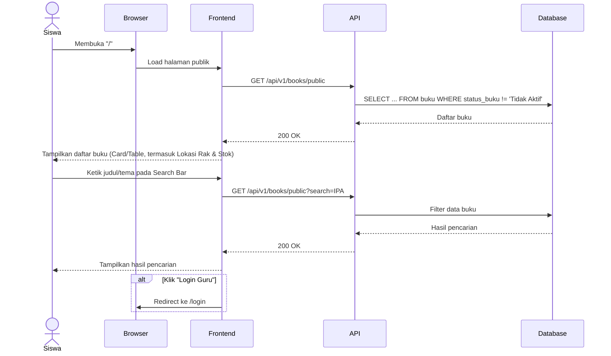

# System Logic: UC-006 Akses Ketersediaan & Lokasi Buku (Publik)

**Document Version:** v1.2 (Tambah section Related Screens & Related Entities; perbaiki rule Rate Limiting yang kontradiktif dengan sifat endpoint publik tanpa sesi)

**Use Case ID:** UC-006

**Use Case Name:** Akses Ketersediaan & Lokasi Buku (Publik)

**Status:** Draft

**Last Updated:** 2026-07-10

**Author:** Kelompok DPSI BRAYYY

---

# 1. Overview

Dokumen ini mendefinisikan logika sistem untuk halaman publik Sistem Informasi Perpustakaan SD Negeri Tamanan. Halaman ini memungkinkan siswa atau pengunjung melihat daftar buku, mencari buku berdasarkan judul atau tema, serta mengetahui lokasi rak, **jumlah stok tersisa**, dan status ketersediaan buku tanpa harus melakukan login. Endpoint pada dokumen ini murni publik — **tidak memerlukan cookie sesi maupun otentikasi dalam bentuk apa pun**.

---

# 2. Related Screens

| Page ID (IA) | Page Name | Route | Access Role |
| --- | --- | --- | --- |
| PAGE-002 | Beranda Publik (Ketersediaan & Lokasi Buku) | `/` | Publik / Guest |

> **Catatan:** Page ID mengikuti pola penomoran `information_architecture.md`; mohon dikonfirmasi ulang terhadap SoT-2 apabila penomoran aktual berbeda.

---

# 3. Related Entities

| Entity (Data Model) | Peran dalam Use Case Ini |
| --- | --- |
| `buku` | Dibaca (SELECT) sepenuhnya read-only, terbatas pada baris dengan `status_buku != 'Tidak Aktif'`; kolom terkait peminjam (`nama_siswa`, denda) tidak pernah diakses dari use case ini. |

> Tidak ada entity `session` yang terlibat — endpoint ini tidak divalidasi middleware `requireAuth` dan tidak menyertakan cookie apa pun.

---

# 4. Sequence Diagram



---

# 5. API Contract

## 5.1 GET /api/v1/books/public

Mengambil seluruh daftar buku yang dapat diakses publik (`status_buku != 'Tidak Aktif'`).

### Request Header

Tidak memerlukan header autentikasi/cookie apa pun — endpoint ini sepenuhnya publik.

### Success Response (200 OK)

```json
{
  "success": true,
  "data": [
    {
      "id_buku": "BK001",
      "judul_buku": "IPA Kelas 4",
      "penulis": "Kemendikbud",
      "tema_buku": "IPA",
      "lokasi_rak": "A1",
      "stok": 3,
      "status_buku": "Tersedia",
      "gambar_sampul": "/uploads/buku_A1_001.jpg"
    },
    {
      "id_buku": "BK002",
      "judul_buku": "Matematika Kelas 5",
      "penulis": "Kemendikbud",
      "tema_buku": "Matematika",
      "lokasi_rak": "B2",
      "stok": 0,
      "status_buku": "Dipinjam",
      "gambar_sampul": null
    }
  ],
  "message": "Success"
}
```

> **Catatan v1.1:** Field `stok` ditambahkan (draft v1.0 tidak menyertakannya, padahal `information_architecture.md` dan `userflow_uc_006.md` eksplisit menyebut "Stok Tersedia" sebagai bagian dari tampilan publik). Field `gambar_sampul` juga ditambahkan (`null` jika belum diunggah Guru, frontend menampilkan placeholder inisial judul — DS v1.5 Section 9.11). Data peminjam (`nama_siswa`) dan nominal denda **tidak pernah** disertakan dalam response ini, sesuai Business Rule Master List poin 10 `srs.md` v3.4.

---

## 5.2 GET /api/v1/books/public?search={keyword}

Melakukan pencarian buku berdasarkan `judul_buku` atau `tema_buku`. **(Direvisi v1.1)** Digabung sebagai query parameter pada endpoint utama (bukan endpoint terpisah `/public/search`), konsisten dengan pola `GET /api/v1/books?search=` (UC-002) dan `GET /api/v1/history?...` (UC-005).

### Query Parameter

| Parameter | Required | Description |
|-----------|----------|-------------|
| `search` | No | Kata kunci judul atau tema |

### Example

```text
GET /api/v1/books/public?search=IPA
```

### Success Response

Format sama seperti Section 5.1, hanya berisi baris yang cocok dengan `search`.

### Error Response (429 Too Many Requests) *(Baru v1.2)*

```json
{
  "success": false,
  "data": null,
  "message": "Terlalu banyak permintaan. Silakan coba lagi sesaat lagi.",
  "errors": []
}
```

> Dipicu oleh rule Rate Limiting pada Section 7 — dihitung secara global di level proses backend, bukan per sesi (lihat catatan Section 7).

### Error Response (500 Internal Server Error)

```json
{
  "success": false,
  "data": null,
  "message": "Gagal memuat data buku",
  "errors": []
}
```

---

# 6. Data Flow

| Step | Input | Process | Output |
|------|-------|---------|--------|
| 1 | Request halaman publik | Ambil seluruh data buku aktif (`status_buku != 'Tidak Aktif'`) | Daftar buku (termasuk stok & gambar sampul) |
| 2 | Kata kunci pencarian | Filter `judul_buku`/`tema_buku` | Data hasil pencarian |
| 3 | Klik Login Guru | Redirect halaman | Halaman Login Guru (`/login`) |

---

# 7. Security Rules

| Rule | Description |
|------|-------------|
| Public Access | Halaman dan seluruh endpoint dapat diakses tanpa login/cookie sesi |
| Read Only | Tidak tersedia operasi Create, Update, Delete |
| Privacy Protection | Data peminjam (`nama_siswa`) dan nominal denda (`total_denda`) tidak pernah ditampilkan pada endpoint ini |
| SQL Injection Protection | Parameter `search` menggunakan prepared statement |
| XSS Protection | Input pencarian disanitasi sebelum diproses |
| **Rate Limiting (Diperbaiki v1.2)** | **Maksimal 60 request per menit, dihitung secara global di level proses backend (in-memory sliding window/token bucket) — bukan per sesi browser dan bukan per-IP. Rule lama ("per sesi browser") kontradiktif dengan Section 1 & Request Header (Section 5.1), yang menegaskan endpoint publik ini tidak menggunakan cookie/session sama sekali sehingga tidak ada kunci sesi untuk dilacak. Karena konteks single-PC lokal (semua request datang dari `localhost`), pelacakan per-IP juga tidak relevan. Permintaan melebihi batas dibalas `429 Too Many Requests` (Section 5.2).** |
| Error Handling | Informasi internal server tidak ditampilkan ke pengguna |
| Cache Support | Data dapat menggunakan cache singkat untuk mempercepat akses publik, dengan invalidasi otomatis setiap kali F007 (Sinkronisasi Stok & Status) berjalan |

---

# 8. Traceability

| Requirement (SRS v3.4) | User Flow AC-ID | API Endpoint |
|------------|-------------|--------------|
| FR-024 (tampilkan daftar buku + ketersediaan + lokasi rak tanpa login) | AC-006-01 | GET /api/v1/books/public |
| FR-025 (pencarian buku publik berdasarkan judul/tema) | AC-006-02 | GET /api/v1/books/public?search= |
| FR-026 (tidak menampilkan data peminjam) | AC-006-03 | GET /api/v1/books/public |
| Business Rule F006 (halaman publik read-only) | AC-006-04 | GET /api/v1/books/public |
| — (tombol Login Guru redirect ke /login) | AC-006-05 | Frontend Routing |

---

# 9. Revision History

| Version | Date | Author | Description |
|---------|------------|----------------------|--------------------------------|
| 1.0 | 2026-07-01 | Kelompok DPSI BRAYYY | Initial Draft System Logic UC-006 — response belum menyertakan field `stok` dan `gambar_sampul`, field naming belum sinkron Data Model. |
| 1.1 | 2026-07-09 | Kelompok DPSI BRAYYY | Perbaikan: (1) tambah field `stok` pada response (`information_architecture.md`/`userflow_uc_006.md` mensyaratkan tampilan "Stok Tersedia" di halaman publik); (2) tambah field `gambar_sampul` (nullable) sinkron DS v1.5 Section 9.11; (3) gabung endpoint `/public/search` ke dalam `/public` dengan query parameter, konsisten dengan pola UC-002/UC-005; (4) field naming diselaraskan `data_model.md` v1.3 (`judul_buku`, `tema_buku`, `status_buku`); (5) tegaskan eksplisit bahwa endpoint ini tidak memerlukan cookie sesi; (6) Traceability Matrix diarahkan ke FR-ID dan AC-ID sesungguhnya. |
| **1.2** | **2026-07-10** | **Kelompok DPSI BRAYYY** | **Perbaikan: (1) tambah Section 2 (Related Screens) dan Section 3 (Related Entities) sesuai checklist minimal isi UCIC; (2) perbaiki rule Rate Limiting (Section 7) yang sebelumnya kontradiktif — rule lama berbunyi "per sesi browser", padahal Section 1 & 5.1 menegaskan endpoint ini tidak menggunakan cookie/session sama sekali. Diganti menjadi pelacakan global di level proses backend; tambah Error Response `429 Too Many Requests` pada Section 5.2.** |